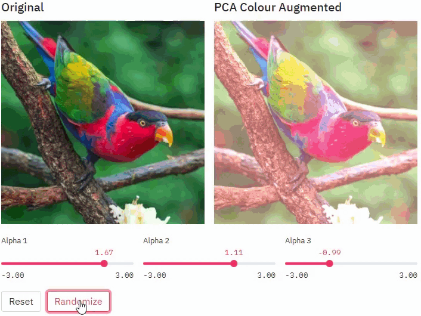

# PCA Colour Augmentation


[](https://share.streamlit.io/amritpurshotam/fancypca/)

Implementation and demo of the PCA colour augmentation technique as described in the [AlexNet](https://papers.nips.cc/paper/2012/file/c399862d3b9d6b76c8436e924a68c45b-Paper.pdf) paper.



## Getting started

This project uses [Python 3.9.6](https://www.python.org/downloads/release/python-396/). Setup your virtual environment then install with the below

```console
pip install -r requirements.txt
```

Then startup with

```console
streamlit run streamlit_app.py
```

## Demo

Live demo of the application can be found on [Streamlit](https://share.streamlit.io/amritpurshotam/fancypca/) where you can also test your own images.

## License
[MIT](./LICENSE)